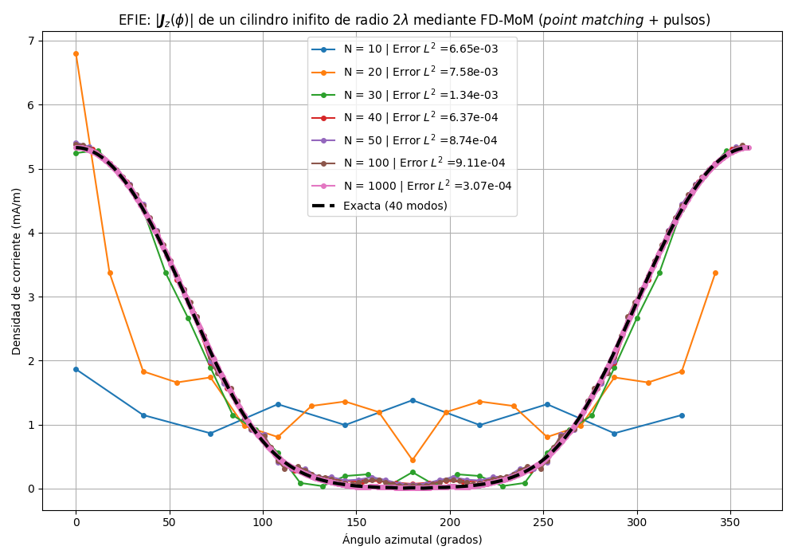
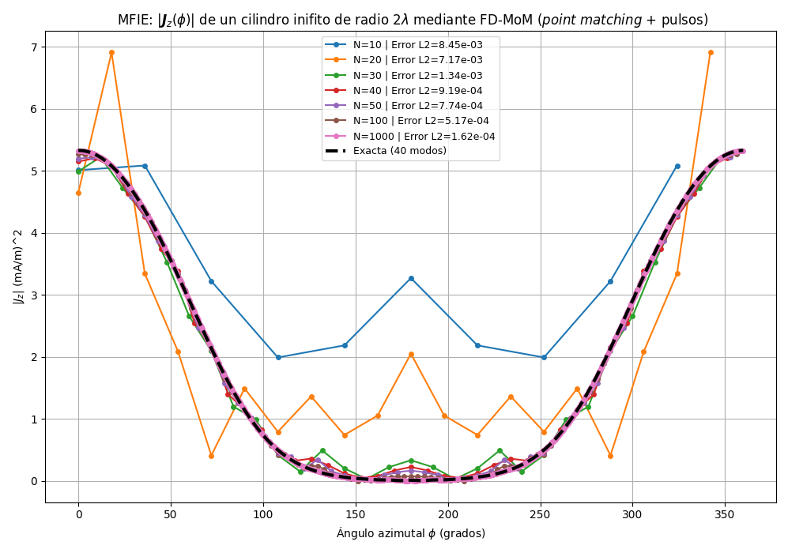
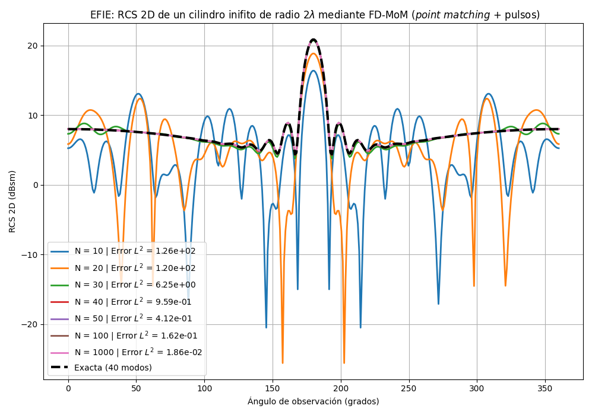
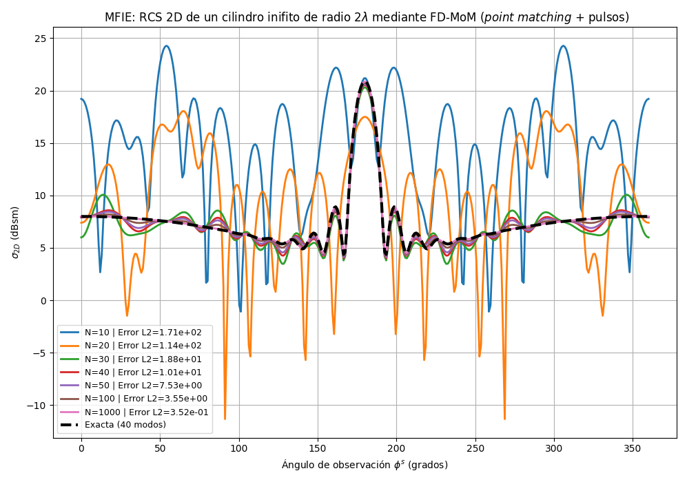
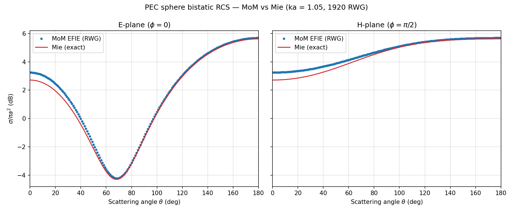

# Method of Moments for Electromagnetic Scattering

Numerical solutions of the **EFIE** and **MFIE** for TM-polarised electromagnetic scattering by a perfectly conducting (PEC) circular cylinder, using the **Frequency-Domain Method of Moments (FD-MoM)**. Includes a 3D EFIE solver with **RWG basis functions** validated against the Mie series.

> **Course project** — *Mathematical and Numerical Complements*, Master's in Physics (Radiation, Nanotechnology, Particles & Astrophysics), University of Granada.

---

## Physical Problem

A PEC cylinder of radius $a$ is illuminated by a TM-polarised plane wave $E_z^i = E_0 e^{-jk\rho\cos\phi}$. The induced surface current $J_z(\phi')$ is found by solving either of two integral equations:

### EFIE (Electric Field Integral Equation)

$$
\hat{n}(\mathbf{r}) \times \mathbf{E}^i(\mathbf{r}) = \hat{n}(\mathbf{r}) \times \left( j\omega\mu \int_S \left[ \mathbf{J}(\mathbf{r}') + \frac{1}{k^2} \nabla'(\nabla' \cdot \mathbf{J}(\mathbf{r}')) \right] G(\mathbf{r},\mathbf{r}') \, d\mathbf{r}' \right)
$$

### MFIE (Magnetic Field Integral Equation)

$$
\hat{n}(\mathbf{r}) \times \mathbf{H}^i(\mathbf{r}) = \frac{J(\mathbf{r})}{2} - \hat{n}(\mathbf{r}) \times \int_S \mathbf{J}(\mathbf{r}') \times \nabla' G(\mathbf{r},\mathbf{r}') \, d\mathbf{r}'
$$

where $G(\boldsymbol{\rho},\boldsymbol{\rho}') = -\frac{j}{4} H_0^{(2)}(k|\boldsymbol{\rho}-\boldsymbol{\rho}'|)$ is the 2D Green's function.

---

## Methods

### 2D EFIE — pulse basis, point matching — `EFIE_pulse.py`

The boundary is discretised into $N$ segments with **pulse basis functions** and tested at segment centres (*point matching*). The circulant structure of the impedance matrix is exploited via `scipy.linalg.solve_circulant` for $O(N \log N)$ solution.

### 2D EFIE — triangular basis, Galerkin — `EFIE_galerkin.py`

Uses **triangular (rooftop) basis functions** and **Galerkin testing** with Gauss quadrature for a more accurate formulation.

### 2D MFIE — pulse basis, point matching — `MFIE_pulse.py`

Same discretisation as `EFIE_pulse.py` applied to the MFIE. Convergence comparisons reveal the MFIE's higher sensitivity to mesh density.

### 3D EFIE — RWG basis, PEC sphere — `EFIE_3D_RWG.py`

Full 3D MoM solver for a PEC sphere using **RWG (Rao–Wilton–Glisson)** basis functions on a triangular mesh generated with `trimesh`. Singularity extraction via Duffy transform. Bistatic RCS pattern validated against the **exact Mie series** (both E- and H-planes). Accelerated with Numba.

---

## Results

### 2D surface currents

<p align="center">


</p>

Left: EFIE surface current vs analytical solution. Right: MFIE surface current vs analytical solution. The EFIE shows faster convergence with fewer segments.

### 2D Radar Cross Section

<p align="center">


</p>

Bistatic 2D RCS ($\sigma_{2D}/\lambda$) from EFIE (left) and MFIE (right), compared with the analytical Mie series.

### 3D PEC sphere — MoM vs Mie

<p align="center">

</p>

Bistatic RCS of a PEC sphere ($r = 0.5$ m) at $ka \approx 1.05$ (100 MHz), E- and H-planes. The 3D EFIE RWG solver (1920 RWG functions, icosphere mesh) matches the exact Mie series to within **~0.1 dB** across all scattering angles.

---

## Reports

| File | Description |
|------|-------------|
| [MemoryEN.pdf](MemoryEN.pdf) | English version — derivation of EFIE/MFIE, MoM discretisation, results and convergence analysis |
| [MemoriaES.pdf](MemoriaES.pdf) | Spanish version (original) |

The LaTeX sources are in the [`latex/`](latex/) folder.

---

## Repository Structure

```
.
├── scripts/
│   ├── EFIE_pulse.py        # 2D EFIE — pulse basis, point matching
│   ├── EFIE_galerkin.py     # 2D EFIE — triangular basis, Galerkin
│   ├── MFIE_pulse.py        # 2D MFIE — pulse basis, point matching
│   └── EFIE_3D_RWG.py       # 3D EFIE — RWG basis, PEC sphere vs Mie
├── MemoryEN.pdf             # Academic report (English)
├── MemoriaES.pdf            # Academic report (Spanish, original)
├── latex/
│   ├── main_EN.tex          # LaTeX source (English)
│   ├── main_ES.tex          # LaTeX source (Spanish)
│   ├── bibliografia.bib     # Bibliography
│   └── escudoUGRmonocromo.png
├── figures/
│   ├── CorrientesEFIE.png   # 2D EFIE surface current
│   ├── CorrientesMFIE.png   # 2D MFIE surface current
│   ├── RCS2DEFIE.png        # 2D EFIE RCS
│   ├── RCS2DMFIE.png        # 2D MFIE RCS
│   └── RCS_3D_sphere.png    # 3D MoM vs Mie
└── LICENSE
```

---

## Requirements

```
numpy  scipy  matplotlib
```

For the 3D solver (`EFIE_3D_RWG.py`):

```
numpy  scipy  matplotlib  trimesh  numba
```

```bash
pip install numpy scipy matplotlib trimesh numba
```

---

## Usage

Run the scripts from the repository root so that the `figures/` output
paths resolve correctly:

```bash
# 2D EFIE (pulse basis) — surface current + RCS vs analytical Mie
python scripts/EFIE_pulse.py

# 2D EFIE (triangular Galerkin basis)
python scripts/EFIE_galerkin.py

# 2D MFIE (pulse basis)
python scripts/MFIE_pulse.py

# 3D EFIE — PEC sphere bistatic RCS vs Mie (requires trimesh + numba)
python scripts/EFIE_3D_RWG.py
```

Key parameters at the top of each file:

| Parameter | Description |
|-----------|-------------|
| `lambda_val` | Wavelength (normalised to 1) |
| `a` | Cylinder/sphere radius |
| `N` | Number of boundary segments (2D) |
| `radius` | Sphere radius in metres (3D) |
| `f_plot` | Single frequency for the bistatic pattern (3D) |

---

## Author

**A. S. Amari Rabah**

Developed as part of the coursework for *Mathematical and Numerical Complements* —
Master's Degree in Physics: Radiation, Nanotechnology, Particles and Astrophysics,
University of Granada, Spain.
